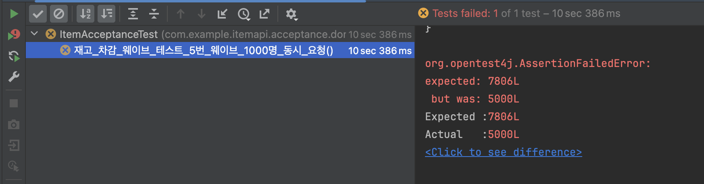

# 동시성 문제와 해결

## 1. 재고 차감에서 동시성 문제가 발생할 수 있는 로직

### 1) 재고 차감 기능
- 동시에 여러명이 하나의 제품의 재고를 차감하려 한다면 한명씩 재고 차감을 할 수 있도록 해야한다.

#### 동시성 문제 발생 이유 :
- 여러 사용자가 동시에 같은 제품의 재고를 차감하려고 시도하면, 시스템이 각 요청을 순차적으로 처리하지 않으면 중복 재고 차감이 발생할 수 있다.
- 데이터베이스 트랜잭션이 적절히 관리되지 않으면, 한 사용자의 재고 차감 과정 중 다른 사용자가 같은 제품의 재고 차감을 할 수 있다.

#### 기대하는 결과 :
- 특정 제품에 대해 재고 차감 요청을 완료한 사용자만 해당 제품 재고를 성공적으로 차감을 한다.
- 다른 사용자들의 동일한 제품 재고 차감 시도는 잠시 대기하고, 재고 차감이 완료되면 다음 사용자가 재고를 차감한다.

### 2)

<br>

## 2. 동시성 이슈 대응 이전의 로직

- 원래 로직은 Service 계층에 @Transactional 어노테이션을 적용하여 트랜잭션을 관리했다.
- 이러한 접근 방식을 선택한 이유는 아래와 같다.

### 트랜잭션 관리 방식 선택 이유

1. 원자성 보장 : 하나의 트랜잭션 내에서 Service 레이어의 모든 로직이 원자성을 가지고 실행되어야 한다고 판단했다.
2. 단순성 : Service 계층에 트랜잭션을 적용함으로써 모든 데이터베이스 연산이 하나의 트랜잭션으로 묶이도록 했다.
3. 일관성 : 모든 비즈니스 로직이 하나의 트랜잭션 내에서 실행되므로, 데이터의 일관성을 유지하기 쉽다고 생각했다.

### 코드 설명

```java
// 재고 차감

@RequiredArgsConstructor
@Service
public class ItemService {
    private final ItemManager itemManager;

    @Transactional
    public void decreaseStock(Long orderId, Long itemId, int decreaseStock) {
       itemManager.decreaseStock(itemId, decreaseStock);
    }
}

@RequiredArgsConstructor
@Component
public class ItemManager {
    private final ItemRepository itemRepository;
    
    public Item decreaseStock(Long itemId, int decreaseCount) {
       Item item = itemRepository.findByIdAndIsDeleteFalse(itemId).orElseThrow(() -> new IllegalArgumentException("해당 품목이 존재하지 않습니다."));
       item.decreaseStock(decreaseCount);

       return item;
    }
}
```

### 재고 차감 로직 설명

1. ItemService 클래스 :
    - decreaseStock() 메서드에 @Transactional 어노테이션이 적용되어 있다.
    - Facade의 역할을 한다.

2. ItemManager 클래스 :
    - decreaseStock() 메서드에서 재고 차감을 수행한다.
    - 제품 정보를 조회한다.
    - 제품 재고 차감전 제품 재고 < decreaseCount 유효성 검사를 한다.
    - 제품 재고를 차감한다.

### 이 접근 방식의 문제점

1. 트랜잭션 범위가 너무 넓다 :
    - 서비스 계층의 메서드 전체가 하나의 트랜잭션으로 묶여 있어, 불필요하게 긴 시간 동안 데이터베이스 리소스를 점유할 수 있다.

2. 동시성 제어의 어려움 :
    - 넓은 트랜잭션 범위로 인해 동시에 여러 요청이 처리될 때 데드락이 발생하거나 성능이 저하될 수 있다.

3. 세밀한 제어의 부재 :
    - 특정 연산에 대해서만 트랜잭션을 적용하거나, 다른 격리 수준을 설정하는 등의 세밀한 제어가 어렵다.

4. 성능 저하 :
    - 모든 연산이 하나의 큰 트랜잭션으로 묶여 있어, 데이터베이스 연결이 오래 유지되면서 전반적인 시스템 성능이 저하될 수 있다.

이러한 문제점들로 인해 동시성 이슈가 발생할 가능성이 높아지며, 특히 높은 트래픽 상황에서 시스템의 안정성과 성능이 저하될 수 있다.  
따라서 동시성 문제에 대응하기 위해서는 트랜잭션의 범위를 좁히고, 더 세밀한 동시성 제어 메커니즘을 도입할 필요가 있다.

## 3. DB 락 구현

### 낙관적 락 (Optimistic Lock)

- 낙관적 락은 동시 업데이트가 드물게 발생한다는 가정 하에 동작한다.
- 이 방식은 데이터 수정 시 충돌이 발생하지 않을 것이라고 이름 그대로 '낙관적으로' 가정하고, 충돌이 발생했을 때 이를 감지하고 처리한다.

#### 코드 구현

```java
@RequiredArgsConstructor
@Service
public class ItemService {

    private final ItemManager itemManager;
    private final OrderEventProducer orderEventProducer;

   public void optimisticDecreaseStock(Long orderId, Long itemId, int decreaseStock) {
      try {
         itemManager.optimisticDecreaseStock(itemId, decreaseStock);
      } catch (RuntimeException e) {
         itemManager.optimisticDecreaseStock(itemId, decreaseStock); // 재시도 하기 위해 추가
      }
   }
}

@RequiredArgsConstructor
@Component
public class ItemManager {
   private final ItemRepository itemRepository;

   public Item decreaseStock(Long itemId, int decreaseCount) {
      Item item = itemRepository.findByIdAndIsDeleteFalseWithLock(itemId).orElseThrow(() -> new IllegalArgumentException("해당 품목이 존재하지 않습니다."));
      item.decreaseStock(decreaseCount);

      return item;
   }
}

public interface ItemJpaRepository extends JpaRepository<Item, Long> {
   @Lock(LockModeType.OPTIMISTIC)
   @Query("select i from Item i where i.id = :itemId and i.isDelete = false ")
   Optional<Item> findByIdAndDeleteWithLock(Long itemId);
}

@Getter
@NoArgsConstructor(access = AccessLevel.PROTECTED)
@Entity
@Table(name = "item")
public class Item {

    @Id
    @GeneratedValue(strategy = GenerationType.IDENTITY)
    @Column(name = "item_id")
    private Long id;

    @Column(name = "name", length = 100, nullable = false, unique = true)
    private String name;

    @Embedded
    private Price price;

    @Column(name = "stock", nullable = false)
    private int stock;

    @Column(name = "is_delete", nullable = false)
    private boolean isDelete;

    @Version
    private Long version = 0L;

}
```
1. ItemService 클래스 :
   - 'optimisticDecreaseStock' 메서드에서 @Transactional 제거했다.
   - try catch 를 사용하여 예외 처리 구현했다.
   - 낙관적 락 실패를 캐치하여 적절한 비즈니스 에외로 변환했다.

2. ItemManager 클래스 :
   - 'decreaseStock' 메서드에 @Transactional 적용하여 트랜잭션 범위를 좁혔다.
   - 'findByIdAndIsDeleteFalseWithLock' 메서드를 사용하여 락이 걸린 상태로 'Item' 엔티티를 조회한다.

3. Entity 클래스 :
   - Item 엔티티에 @Version 어노테이션을 사용한 버전 필드를 추가했다.
   - 이 version 필드는 JPA에 의해 자동으로 관리되며, 엔티티가 업데이트될 때마다 증가한다.

#### 주요 변경 사항

1. 트랜잭션 범위 축소 :
   - 트랜잭션의 범위를 Service에서 Manager로 내려 작은 단위로 제어 했다.
   - 이를 통해 트랜잭션 유지 시간을 줄이고, 리소스 점유를 최소화했다.

2. 낙관적 락 구현 :
   - 엔티티에 버전 정보를 추가하여 JPA의 낙관적 락 기능을 활용했다.
   - 동시 수정 시 발생하는 충돌을 감지하고 예외를 발생시킨다.

3. 예외 처리 :
   - 낙관적 락 실패 시 발생하는 예외를 커스텀한 예외를 뱉도록 명시적으로 처리하여 사용자에게 적절한 응답을 제공하도록 했다.

#### 테스트 코드 - 성공 케이스 - 2변 시도

```java
@Test
void 동시에_재고_차감_2개() throws InterruptedException {
    ItemRequest.AddItem request = ItemRequest.AddItem.builder()
            .name("모자")
            .price(BigDecimal.valueOf(10_000))
            .stock(2)
            .build();
    ExtractableResponse<Response> addResponse = 제품_등록_요청(request);

    CompletableFuture.allOf(
            CompletableFuture.runAsync(() -> 재고_차감_요청(1L, 1)),
            CompletableFuture.runAsync(() -> 재고_차감_요청(1L, 1))
    ).join();

    ExtractableResponse<Response> response = 제품_단건_조회_요청(1L);

    assertAll(
            () -> assertThat(response.jsonPath().getLong("itemId")).isEqualTo(1L),
            () -> assertThat(response.jsonPath().getString("name")).isEqualTo("모자"),
            () -> assertThat(response.jsonPath().getString("price")).isEqualTo("10000"),
            () -> assertThat(response.jsonPath().getInt("stock")).isEqualTo(0)
    );
}
```
#### 테스트 코드 설명
- 2개의 스레드를 사용하여 동시에 재고 차감을 시도한다.
- 각 스레드는 1개씩 재고 차감을 시도한다.
- 테스트 결과, 최종 재고는 0개 임을 확인핟.

#### 테스트 코드 - 실패 케이스 - 5000번 시도
```java
@Test
void 재고_차감_웨이브_테스트_5번_웨이브_1000명_동시_요청() throws InterruptedException {
    ItemRequest.AddItem request = ItemRequest.AddItem.builder()
            .name("모자")
            .price(BigDecimal.valueOf(10_000))
            .stock(10_000)
            .build();
    ExtractableResponse<Response> addResponse = 제품_등록_요청(request);

    int waveCount = 5;
    int concurrencyPerWave = 1_000;
    decreaseTestWave(() -> 재고_차감_요청(1L, 1), waveCount, concurrencyPerWave);
}

private void decreaseTestWave(Runnable action, int waveCount, int concurrencyPerWave) throws InterruptedException {
    int stock = 제품_단건_조회_요청(1L).jsonPath().getInt("stock");

    ExecutorService executorService = Executors.newFixedThreadPool(32);

    for (int wave = 1; wave <= waveCount; wave++) {
        CountDownLatch latch = new CountDownLatch(concurrencyPerWave);

        for (int i = 0; i < concurrencyPerWave; i++) {
            executorService.submit(() -> {
                try {
                    action.run();
                } finally {
                    latch.countDown();
                }
            });
        }

        latch.await();

        long sleepTime = (long) (500 + Math.random() * 1000);
        Thread.sleep(sleepTime);
    }

    executorService.shutdown();
    int resultStock = 제품_단건_조회_요청(1L).jsonPath().getInt("stock");

    long totalOrders = (long) waveCount * concurrencyPerWave;

    long expected = stock - totalOrders;
    long actual = resultStock;

    assertThat(expected).isEqualTo(actual);
}
```


- 테스트가 깨지게 된다.

#### 결론 및 고찰
1. 낙관적 락의 효과와 한계 :
   - 적은 동시 요청에 대해서는 낙관적 락이 효과적으로 동작함을 확인했다.
   - 하지만 많은 동시 요청 테스트에서는 실패가 발생했다. 이는 낙관적 락의 한계를 보여준다.

2. 동시성 증가에 따른 문제 :
   - 동시 요청 수가 증가함에 따라 충돌 발생 확률이 높아진다.
   - 충돌 발생할 때마다 예외가 발생하고 재시도가 필요하므로, 로직이 복잡한 경우 전체적인 처리 시간이 길어질 수 있다.
   - 극단적인 경우, 모든 요청이 계속 충돌하여 결과적으로 처리되지 못하는 상황(livelock)이 발생할 수 있다.

3. 성능과 정확성의 트레이드오프 :
   - 낙관적 락은 충돌이 적은 환경에서 높은 성능을 제공한다.
   - 그러나 충돌이 빈번한 환경에서는 재시도로 인한 오버헤드가 크게 증가할 수 있다.

4. 실제 운영 환경 고려사항 :
   - 실제 서비스의 동시 요청 패턴과 빈도를 분석하여 적절한 동시성 제어 메커니즘을 선택해야 한다.

5. 재시도 로직 구현 :
   - 낙관적 락 실패 시 즉시 에러를 반환하기 보다는, 일정 횟수만큼 재시도하는 로직을 구현할 수 있겠다.
   - 이를 통해 일시적인 충돌로 인한 실패를 줄이고 성공을 높일 수 있다.

결론적으로, 낙관적 락은 간단하고 효과적인 동시성 제어 방법이지만, 높은 동시성 환경에서 한계가 있음을 확인했다.

### 비관적 락 (Pessimistic Lock)

- 비관적 락은 동시 업데이트가 빈번하게 발생할 것이라고 '비관적으로' 가정하고, 데이터를 읽는 시점에 락을 걸어 다른 트랜잭션의 접근을 차단한다.
- 이 방식은 데이터 무결성을 강하게 보장하지만, 동시성 처리 성능이 낮아질 수 있다.

#### 코드 구현

```java
@RequiredArgsConstructor
@Service
public class ItemService {

    private final ItemManager itemManager;
    private final OrderEventProducer orderEventProducer;

   public void pessimisticDecreaseStock(Long orderId, Long itemId, int decreaseStock) {
      try {
         itemManager.pessimisticDecreaseStock(itemId, decreaseStock);
      } catch (PessimisticLockingFailureException e) {
         // 에러 핸들링
      }
   }
}

@RequiredArgsConstructor
@Component
public class ItemManager {

    private final ItemRepository itemRepository;

   @Transactional
   public Item pessimisticDecreaseStock(Long itemId, int decreaseCount) {
      Item item = itemRepository.findByIdAndIsDeleteFalse(itemId).orElseThrow(() -> new IllegalArgumentException("해당 품목이 존재하지 않습니다."));
      item.decreaseStock(decreaseCount);

      return item;
   }
}

@Lock(LockModeType.PESSIMISTIC_WRITE)
@Query("select i from Item i where i.id = :itemId and i.isDelete = false ")
Optional<Item> findByIdAndDelete(Long itemId);
```

1. ItemService 클래스 :
   - try catch 를 사용하여 예외 처리를 구현했다.
   - 비관적 락 실패를 캐치하여 적절한 비즈니스 예외로 변환한다.

2. ItemManager 클래스 :
   - 'pessimisticDecreaseStock' 메서드에 @Transactional 어노테이션을 적용하여 트랜잭션 범위를 좁혔다.
   - 'findByIdAndIsDeleteFalse' 메서드를 사용하여 비관적 락이 걸린 상태로 Item 엔티티를 조회하도록 했다.

3. Repository 클래스 : 
   - '@Lock(LockModeType.PESSIMISTIC_WRITE)' 어노테이션을 사용하여 비관적 락을 구현했다.

#### 테스트 코드
```java
@Test
void 재고_차감_웨이브_테스트_5번_웨이브_1000명_동시_요청() throws InterruptedException {
    ItemRequest.AddItem request = ItemRequest.AddItem.builder()
            .name("모자")
            .price(BigDecimal.valueOf(10_000))
            .stock(10_000)
            .build();
    ExtractableResponse<Response> addResponse = 제품_등록_요청(request);

    int waveCount = 5;
    int concurrencyPerWave = 1_000;
    decreaseTestWave(() -> 재고_차감_요청(1L, 1), waveCount, concurrencyPerWave);
}

private void decreaseTestWave(Runnable action, int waveCount, int concurrencyPerWave) throws InterruptedException {
    int stock = 제품_단건_조회_요청(1L).jsonPath().getInt("stock");

    ExecutorService executorService = Executors.newFixedThreadPool(32);

    for (int wave = 1; wave <= waveCount; wave++) {
        CountDownLatch latch = new CountDownLatch(concurrencyPerWave);

        for (int i = 0; i < concurrencyPerWave; i++) {
            executorService.submit(() -> {
                try {
                    action.run();
                } finally {
                    latch.countDown();
                }
            });
        }

        latch.await();

        long sleepTime = (long) (500 + Math.random() * 1000);
        Thread.sleep(sleepTime);
    }

    executorService.shutdown();
    int resultStock = 제품_단건_조회_요청(1L).jsonPath().getInt("stock");

    long totalOrders = (long) waveCount * concurrencyPerWave;

    long expected = stock - totalOrders;
    long actual = resultStock;

    assertThat(expected).isEqualTo(actual);
}
```     

#### 결과 및 고찰

1. 정확성 :
   - 비관적 락은 1000개의 동시 요청 모두 정확하게 재고 차감 성공을 보장했다.
   - 이는 비관적 락이 높은 동시성 환경에서도 데이터 무결성을 확실히 보장함을 보여주는 것이다.

2. 트레이드 오프 :
   - 비관적 락은 데이터 정합성을 강력하게 보장하지만, 동시에 처리할 수 있는 트랜잭션의 수가 제한된다.
   - 높은 동시성 환경에서는 전체적인 시스템 처리량이 낮아질 수 있다.

3. 사용 시나리오 :
   - 데이터 정합성이 매우 중요하고, 충돌이 자주 발생하는 환경에서는 유용하다.

4. 확장성 고려 :
   - 비관적 락은 데이터베이스 수준의 락을 사용하므로, 분산 환경에서의 확장성에 제한이 있을 수 있다.
   - 대규모 시스템에서는 분산 락과의 조합을 고려해볼 수 있다.

<br>

## 4. 분산 락 구현

- 분산 락은 여러 서버나 인스턴스에서 동시에 접근하는 리소스에 대한 동시성을 제어하기 위해 사용된다.
- Redis를 이용한 분산 락을 커스텀 어노체이션과 함께 AOP를 통해 구현했다.

```java

```
