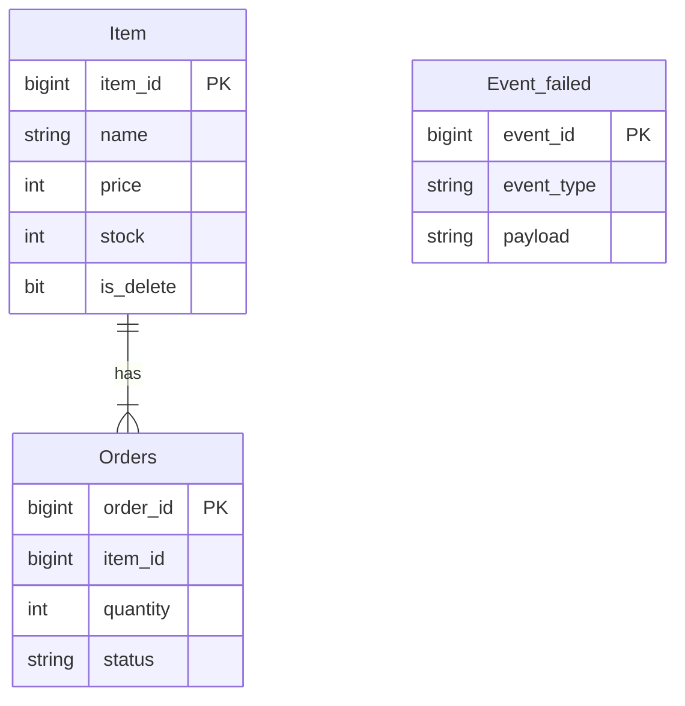

```mermaid
erDiagram
    Item ||--|{ Orders : has
    
    Item {
        bigint item_id PK
        string name
        int price
        int stock
        bit is_delete
    }
    
    Orders {
        bigint order_id PK
        bigint item_id
        int quantity
        string status
    }
    
    Event_failed {
        bigint event_id PK
        string event_type
        string payload
    }
```
