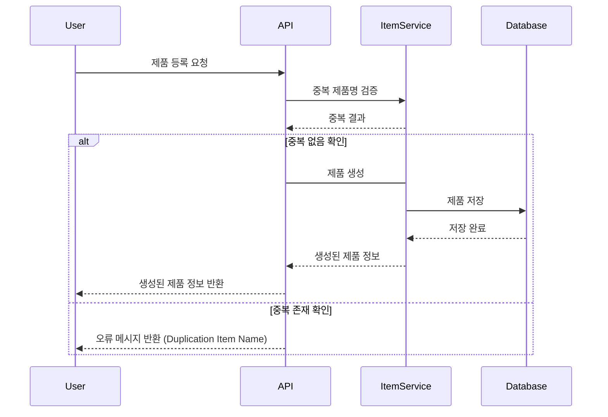
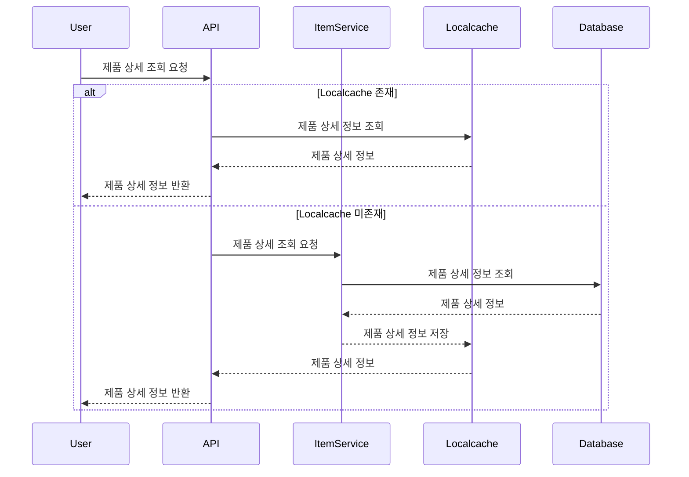

## 1. 제품 등록

### 이벤트 시퀀스 다이어그램

### Description

유저가 제품을 등록합니다.

제품 생성을 요청하고 제품 정보를 DB에 저장합니다.

생성된 제품의 정보를 반환합니다.

 

## 2. 제품 상세 조회

### 이벤트 시퀀스 다이어그램

### Description

제품 상세 정보를 조회합니다.

 

## 3. 제품 정보 수정

### 이벤트 시퀀스 다이어그램

