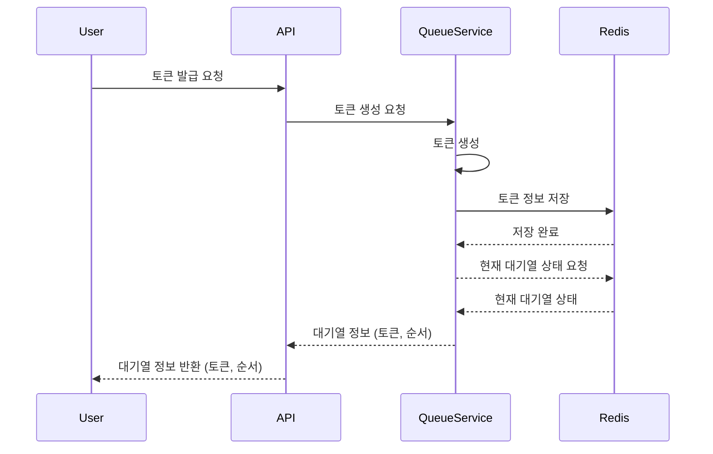
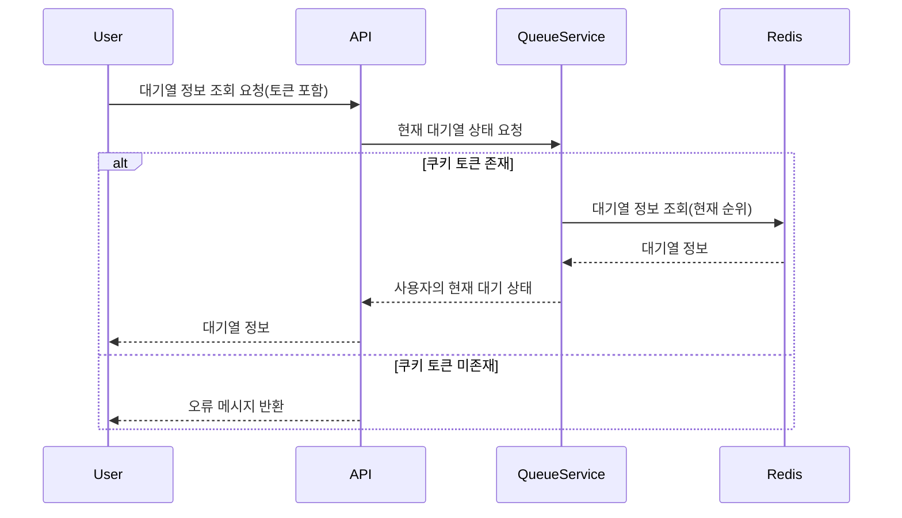
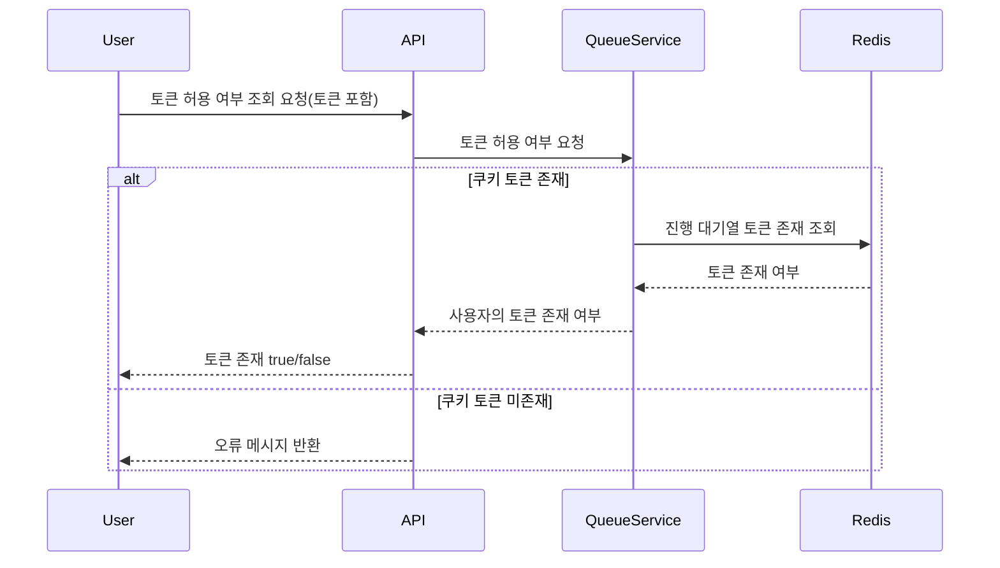

## 1. 제품 등록

### 이벤트 시퀀스 다이어그램

### Description

유저가 제품을 등록합니다.

제품 생성을 요청하고 제품 정보를 DB에 저장합니다.

생성된 제품의 정보를 반환합니다.

 

## 2. 제품 상세 조회

### 이벤트 시퀀스 다이어그램

### Description

제품 상세 정보를 조회합니다.

 

## 3. 제품 정보 수정

### 이벤트 시퀀스 다이어그램

### Description

제품 상세 정보를 수정합니다.

 

## 4. 제품 삭제

### 이벤트 시퀀스 다이어그램

### Description

제품을 삭제합니다.

 

## 4. 주문하기

### 이벤트 시퀀스 다이어그램

### Description

주문 하기를 합니다.
결제를 진행합니다.
결제에 성공하면 주문 상태를 결제 완료 상태로 변경합니다.

 

## 5. 대기열 토큰 발급

### 이벤트 시퀀스 다이어그램

### Description

유저가 주문을 시도할 때, 토큰을 발급받습니다.  
현재 대기열의 상태를 조회하고, 토큰 생성을 요청하여 Redis에 저장합니다.  
생성된 토큰과 조회한 대기열의 상태 정보를 반환합니다.

 

## 6. 토큰 대기열 정보 조회

### 이벤트 시퀀스 다이어그램

### Description

토큰을 통해 대기열 정보를 조회합니다.  
폴링으로 대기열을 확인하는 것을 전제합니다.

 

## 7. 토큰 대기열 허용 여부 조회

### 이벤트 시퀀스 다이어그램

### Description

토큰을 통해 허용된 토큰 집합의 존재 유무를 조회합니다.

 
